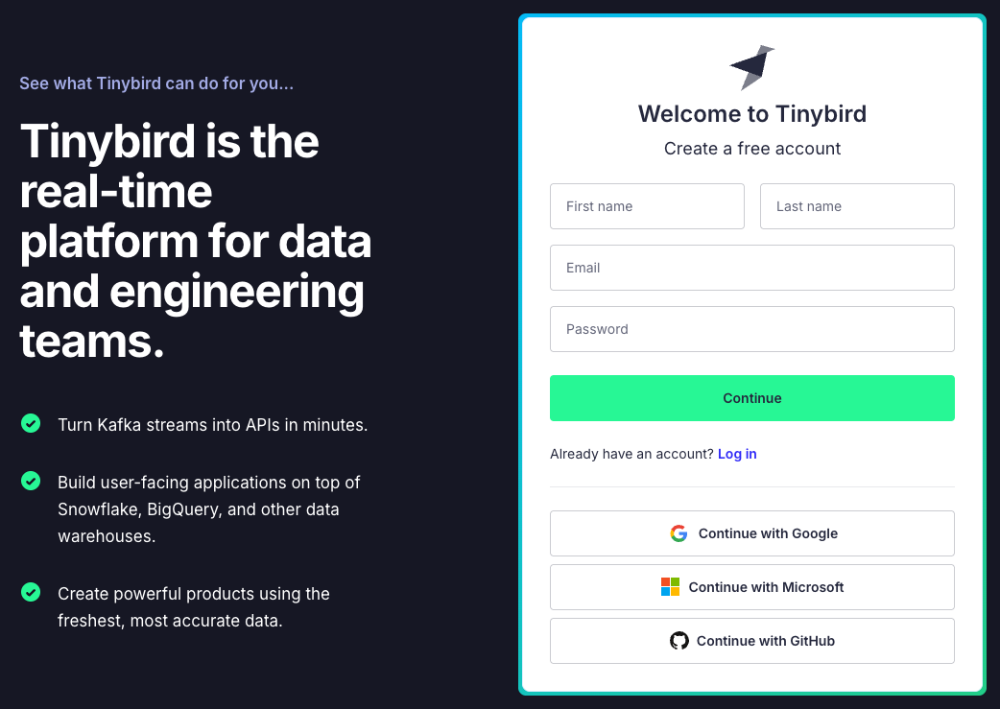
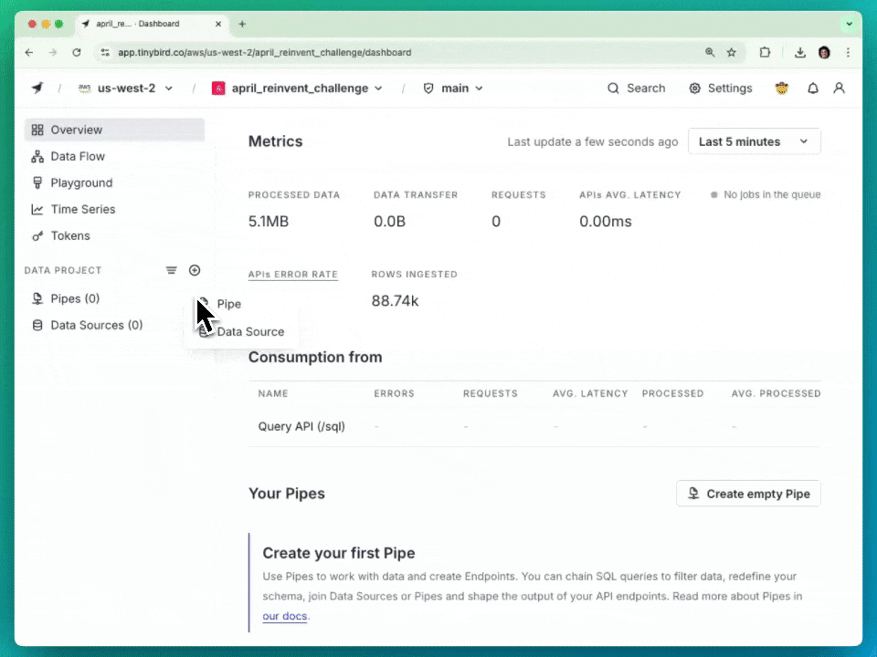
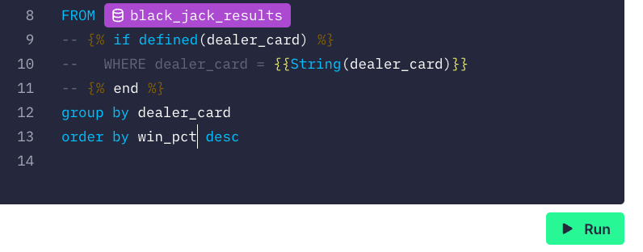
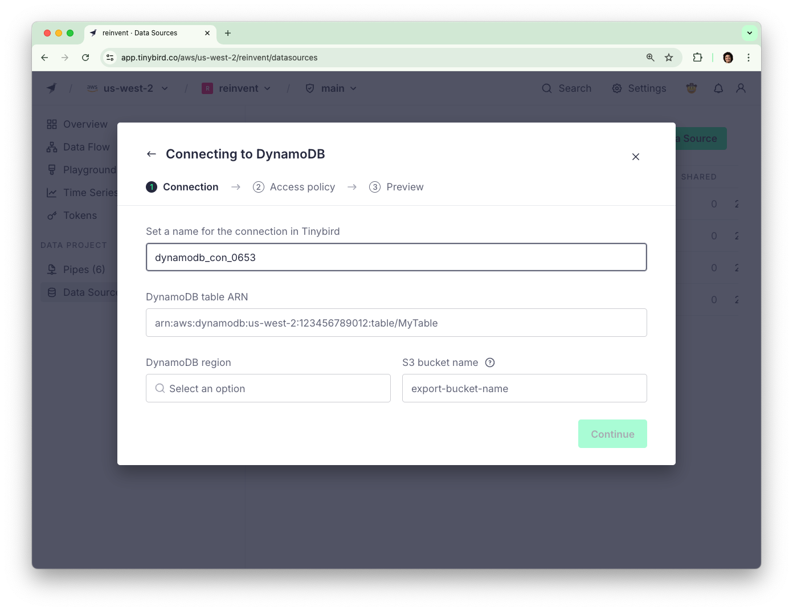

# Try Tinybird. Win an iPhone 16.
Completing the main challenge takes just a few minutes. Each step increases your odds to win! 

If you want to improve your odds even more, there's extra credit at the end.

The deadline to finish is **Friday, December 13th at 11:59 PM EST**. Winners will be announced the following week. Terms and conditions can be found [here](https://tbrd.co/aws-challenge).

## TL;DR Steps
1. [Sign up](https://app.tinybird.co/signup) for a free Tinybird account (1 entry)
2. Ingest the following to create a Data Source: https://reinvent-challenge.s3.us-west-2.amazonaws.com/black_jack_results.csv  (2 entries)
3. Create a Pipe to determine chances of dealer winning based on their card (3 entries)
4. Publish your Pipe as an API Endpoint and [submit the HTTP URL](https://forms.gle/HiRTFjbRy9di7Mzt7) (5 entries)
5. Share your work on social and tag us (10 entries)
6. For even more entries, check out the **Extra Credit** below

## Detailed Steps

#### [Sign up](https://app.tinybird.co/signup) for a free Tinybird account (1 entry)
Get started in seconds, no credit card required.

#### Ingest some data (2 entries)
Using the Remote URL option, create a new Data Source by ingesting the following csv: https://reinvent-challenge.s3.us-west-2.amazonaws.com/black_jack_results.csv

Source: [Theoretical Black Jack Results](https://www.kaggle.com/datasets/flynn28/theoretical-black-jack-results/) Dataset by Aiden Flynn on Kaggle

Options for Reason column:
- 1 = win for player / loss for dealer
- 2 = loss for player / win for dealer
- 3 = push (draw)

#### Build a Pipe (3 entries)
Use your SQL skills to determine the odds of the dealer winning based on their card, ordered by decreasing win percentage. Your results should look something like:

| dealer_card | win_pct |
| - | - |
 A | 0.5957 
 K | 0.5437 
 10 | 0.5343 
... | ...

#### Publish an API (5 entries)
Time to celebrate - click the big green **Create API Endpoint** button, copy the HTTP url, and [submit it here](https://forms.gle/HiRTFjbRy9di7Mzt7).

#### Share your work on social! (10 entries)
Tag us in a post about your experience trying out Tinybird!

## Extra Credit
Loving Tinybird so far? Want to earn more raffle entires? Here's some extra credit you can try.

You can submit proof of extra credit through the [same form](https://forms.gle/HiRTFjbRy9di7Mzt7) as the main challenge.

#### Add a Parameter to Your API (5 entires)
Update the API endpoint you built in the main challenge to allow specifying which card to receive win probabilities for.

#### Create a Chart (10 entries)
Create a stacked bar chart that shows the dealer's wins, losses, and draws based on their card. Note: you may need to update your endpoint.

#### Create an API Endpoint with DynamoDB Data (20 entries)
Have data in Dynamo? Bring it into Tinybird and create an API endpoint.

[DynamoDB Connector docs](https://www.tinybird.co/docs/ingest/dynamodb#load-a-table-using-the-ui)

#### Share on social about extra credit! (10 entries)
Tag us in another post sharing your experience with extra credit. Maybe it includes a screenshot of the chart you made or how easy it was to create an API from DynamoDB data.